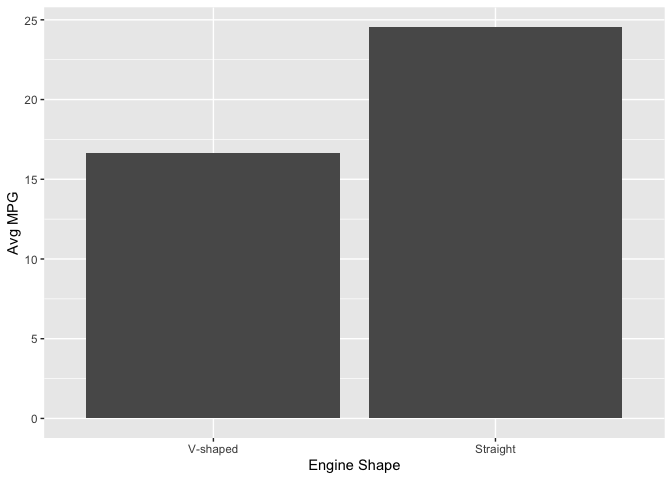
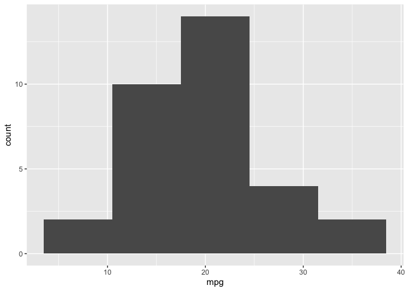
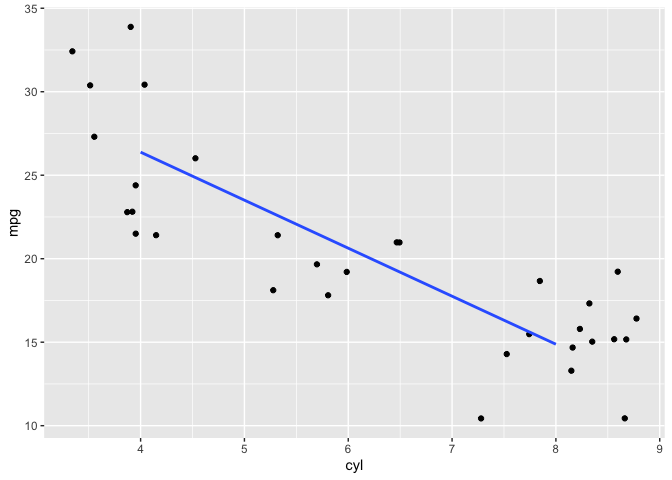
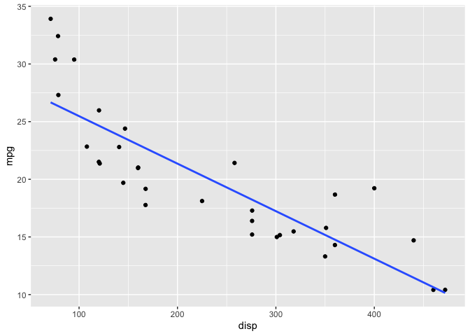
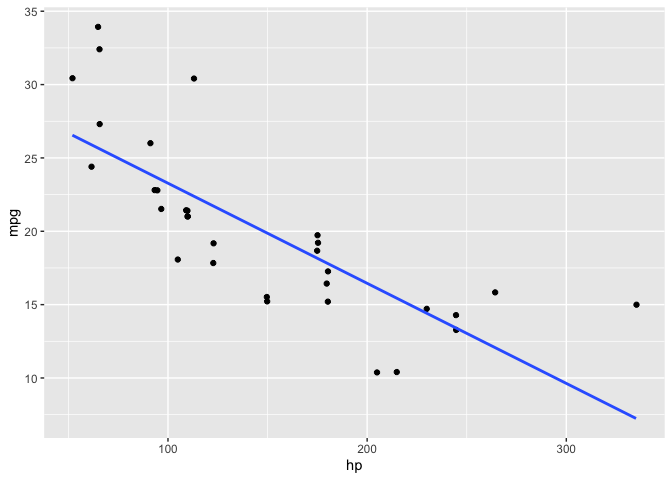
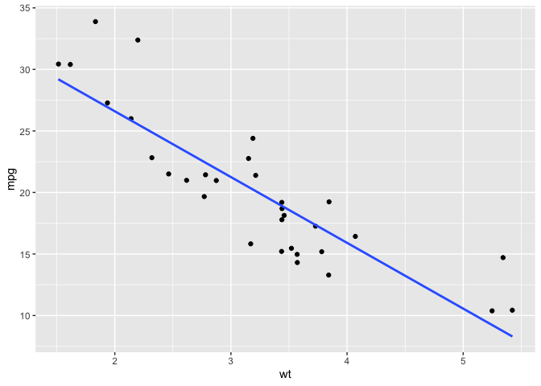
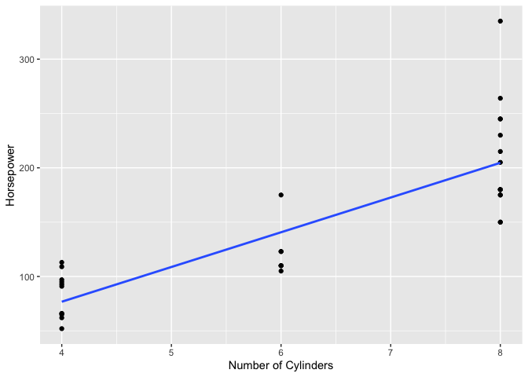

The goal of this exploratory data analysis is to extract some trends
from this dataset as well as to explain all of the code used to do so.
This can serve as a learning resource for those who want to learn r as
well as those who want to learn more about inferential statistical
techinques.

``` r
library(tidyverse)
library(psych)
library(lm.beta)
library(car)
```

Let’s load in the data for this exploratory data analysis. This is one
of the datasets that is included in R called The Motor Trend Car Road
Tests (mtcars). To get a deeper look at the dataset, the command
‘?mtcars’ can be used. The dataset includes extracted information from
the 1974 Motor Trend magazine. It includes 10 aspects of automobile
design and performance for 32 cars (1973-1974 models only).

``` r
data(mtcars)
```

Another way to learn more about the dataset is to use the ‘names()’
command. This command will give you all of the variable names in the
dataset. The next step would be looking at what types of variables each
one is which is accomplished by using the ‘str()’
    command.

``` r
names(mtcars)
```

    ##  [1] "mpg"  "cyl"  "disp" "hp"   "drat" "wt"   "qsec" "vs"   "am"   "gear"
    ## [11] "carb"

``` r
str(mtcars)
```

    ## 'data.frame':    32 obs. of  11 variables:
    ##  $ mpg : num  21 21 22.8 21.4 18.7 18.1 14.3 24.4 22.8 19.2 ...
    ##  $ cyl : num  6 6 4 6 8 6 8 4 4 6 ...
    ##  $ disp: num  160 160 108 258 360 ...
    ##  $ hp  : num  110 110 93 110 175 105 245 62 95 123 ...
    ##  $ drat: num  3.9 3.9 3.85 3.08 3.15 2.76 3.21 3.69 3.92 3.92 ...
    ##  $ wt  : num  2.62 2.88 2.32 3.21 3.44 ...
    ##  $ qsec: num  16.5 17 18.6 19.4 17 ...
    ##  $ vs  : num  0 0 1 1 0 1 0 1 1 1 ...
    ##  $ am  : num  1 1 1 0 0 0 0 0 0 0 ...
    ##  $ gear: num  4 4 4 3 3 3 3 4 4 4 ...
    ##  $ carb: num  4 4 1 1 2 1 4 2 2 4 ...

All of the variables are numerical and there don’t look to be any
missing values. Just to start out, lets look at the relation between
miles per gallon and horsepower. One would expect that as horsepower
increases, the car would use more gas and thus not be as efficient. We
can look at this both visually using a graph and look at the relation
statistically using a correlation
test.

``` r
ggplot(data = mtcars, aes(x = hp, y = mpg)) + geom_point() + geom_smooth(method = "lm", se = FALSE)
```

<!-- -->

``` r
cor.test(mtcars$mpg, mtcars$hp)
```

    ## 
    ##  Pearson's product-moment correlation
    ## 
    ## data:  mtcars$mpg and mtcars$hp
    ## t = -6.7424, df = 30, p-value = 1.788e-07
    ## alternative hypothesis: true correlation is not equal to 0
    ## 95 percent confidence interval:
    ##  -0.8852686 -0.5860994
    ## sample estimates:
    ##        cor 
    ## -0.7761684

As expected, there is a negative relation between the two variables in
that as horsepower increases, miles per gallon decrease (r = -0.78, p \<
.001). Although there was probably no random sampling involved in
obtaining this data, these findings likely would be able to generalize
to other older cars but these findings may not be generalizable to newer
cars. Because the p value is so low, there is an extremely low chance of
obtaining this difference by chance alone. Additionally, the magnitude
of the relation is extremely strong.

Let’s calculate a quick predictive model to represent how much we can
expect mpg to change in response to modifying the horsepower.

``` r
lm.shape <- lm(mpg ~ hp, data = mtcars)
lm.shape.beta <- lm.beta(lm.shape)
summary(lm.shape.beta)
```

    ## 
    ## Call:
    ## lm(formula = mpg ~ hp, data = mtcars)
    ## 
    ## Residuals:
    ##     Min      1Q  Median      3Q     Max 
    ## -5.7121 -2.1122 -0.8854  1.5819  8.2360 
    ## 
    ## Coefficients:
    ##             Estimate Standardized Std. Error t value Pr(>|t|)    
    ## (Intercept) 30.09886      0.00000    1.63392  18.421  < 2e-16 ***
    ## hp          -0.06823     -0.77617    0.01012  -6.742 1.79e-07 ***
    ## ---
    ## Signif. codes:  0 '***' 0.001 '**' 0.01 '*' 0.05 '.' 0.1 ' ' 1
    ## 
    ## Residual standard error: 3.863 on 30 degrees of freedom
    ## Multiple R-squared:  0.6024, Adjusted R-squared:  0.5892 
    ## F-statistic: 45.46 on 1 and 30 DF,  p-value: 1.788e-07

This regression model indicates that for every increase of 1 HP, we can
expect a decrease in MPG by -0.07. The standardized coeffiecient was
included to emphasize that a beta weight is equivalent to a correlation
coefficient if there is nothing being controlled for. Lets take this
model and see what it would predict the MPG would be for a car with 300
HP like the Genesis Coupe. To do this, we will first need to create a
new data frame for the Genesis Coupe and input the HP. Then we will be
able to use the model specified above to predict how many MPGs the
Genesis Coupe would get.

``` r
gencoupe <- data.frame(hp = 300)
predict(lm.shape, gencoupe)
```

    ##        1 
    ## 9.630377

This model would predict that the 2017 Genesis Coupe with 300 HP would
get about 9.63 MPG. That is much lower than the true MPG of the Genesis
Coupe which is about 30. Remember that the model only included cars
built in 1973 and 1974 so generalizing too far outside that time range
is not appropriate. In order to properly generalize to a newer car like
the Genesis Coupe, we would need to include newer cars in the dataset
and optimally would use the year the car was made as a predictor rather
than just HP alone.

Having said all that, let’s take a little deeper look to see if there
even were cars with 300 HP included in the dataset. If there weren’t, we
should be even more hesitant to believe this prediction as the model may
not have had any cars that powerful included. We must be careful not to
generalize our regression too far outside the bounds of the dataset. We
will do this in two ways. The first way will return the range of HP
included in the dataset and the second way will sort our dataset by HP
in descending order and will return the first several values.

``` r
mtcars %>% select(hp) %>% range()
```

    ## [1]  52 335

``` r
sort(mtcars$hp, decreasing = TRUE) %>% head()
```

    ## [1] 335 264 245 245 230 215

Sure enough, there was one car that had 335 HP included in the dataset.
However, that was the only car that was over 300 HP. Cars in those days
were nowhere near as powerful as they are now. Clearly the technology
has changed from 1974 and this regression model does not account for
that. My point here is: be careful what you generalize to. There is no
statistical analysis that can allow you to infer causality or
generalizability; that has to do with the methodology (e.g. sampling
type and assignment strategy).

Let’s now take a look at some other variables and relations that may not
be as obvious. First, let’s transform the numerical ‘vs’ variable to a
factor with two levels. This variable represents the shape of the engine
which is either V-shaped or straight. We will save this factor as a new
variable so that we can still use the numeric version when needed.
Making the variable a factor just makes it a little easier to read in
some situations like graphs and descriptive statistics.

After that, we will create a graph of the avg MPG for each type of
engine shape (v-shaped and straight) to see if one engine shape is more
efficient than the other. We want a bar graph because one of our
variables is binary and the other is quantitative. Inside of the bar
plot, using the commands ‘stat = “summary”, fun.y = “mean”’ allows us to
plot the group means rather than some other summary like the ‘stat =
“identity”’ command. Additionally, the ‘xlab()’ and ‘ylab()’ commands
allow us to add on layers that represent what we want our axis labels to
be. Xlab represents the X axis label and similarly ylab represents the Y
axis label. Because we already converted the ‘vs’ variable to a factor
with the correct labels, those labels will automatically show up on the
graph as long as we use the factor we created in the first line of code
and not the numerical
version.

``` r
mtcars <- mtcars %>% mutate(vs2 = factor(vs, levels = c(0, 1), labels = c("V-shaped", "Straight")))
ggplot(data = mtcars, aes(x = vs2, y = mpg)) + geom_bar(stat = "summary", fun.y = "mean") + xlab("Engine Shape") + ylab("Avg MPG")
```

<!-- -->

As you can see, v shaped engines actually get lower MPG when compared to
straight shapes. Let’s look in to this a little
    deeper..

``` r
ggplot(data = mtcars, aes(x = mpg)) + geom_histogram(binwidth = 7)
```

<!-- -->

``` r
describe(mtcars$mpg)
```

    ##    vars  n  mean   sd median trimmed  mad  min  max range skew kurtosis
    ## X1    1 32 20.09 6.03   19.2    19.7 5.41 10.4 33.9  23.5 0.61    -0.37
    ##      se
    ## X1 1.07

It appears that MPG is approximately normally distributed with a
skewness value of 0.61 and a kurtosis value of -0.37. Both of these
values are well within the bounds of normality. Additionally, the
histogram appears to be approximately normally distrbuted. One of the
assumptions of many statistical methods such as the ones used here
require that variables are approximately normally distributed. Now that
we know that our main variable is, we can move forward with out
analyses. Let’s check out the exact values of the avg MPG per group.

``` r
mtcars %>% group_by(vs2) %>% summarise(mean.mpg = mean(mpg))
```

    ## # A tibble: 2 x 2
    ##   vs2      mean.mpg
    ##   <fct>       <dbl>
    ## 1 V-shaped     16.6
    ## 2 Straight     24.6

This echos what the graph told us; that straight engines tend to be more
fuel efficient than v-shaped engines. Now let’s see if this difference
is statistically significant or if it is likely due to chance.

``` r
t.test1 <- t.test(mpg ~ vs, data = mtcars)
t.test1
```

    ## 
    ##  Welch Two Sample t-test
    ## 
    ## data:  mpg by vs
    ## t = -4.6671, df = 22.716, p-value = 0.0001098
    ## alternative hypothesis: true difference in means is not equal to 0
    ## 95 percent confidence interval:
    ##  -11.462508  -4.418445
    ## sample estimates:
    ## mean in group 0 mean in group 1 
    ##        16.61667        24.55714

It appears that straight engines (m = 24.56) are significantly more fuel
efficient than v-shaped engines (m = 16.62), t(22.72) = -4.67, p \<
.001. We are now able to say that this difference is extremely unlikely
to occur by chance.

This finding is strange though.. If you are familiar with cars and
engine shapes, you probably know that v shaped engines tend to be used
with engines that have more than 4 cylinders whereas straight engine
shapes tend to be used with engines that have 4 cylinders. Also, you may
be aware that as an engine has more cylinders, it uses more gas and
therefore is likely to become less fuel efficient. Perhaps the
difference in fuel efficiency between v-shaped engines and straight
shaped engines is actually due to the number of cylinders it has and not
the shape of the engine itself. To do this, we will create a new
regression model that controls for the number of cylinders.

Let’s go over what setting up a regression is like briefly. First you
must create an object in the r enviornment that represents your
regression. This is done in the first line of the code which specifies
the name of the object that represents the regression model, and also
specifies the equation of the model, the dataset, and the the type of
model it is (in this case a linear regression model). The second line of
code adds standardized regression weights to the model. The third line
of code gives a summary of the model created in the previous two lines
of code and the final line of code returns the VIF values of the model
used to diagnose the model.

``` r
lm.shape.cyl <- lm(mpg ~ vs + cyl, data = mtcars)
lm.shape.cyl.beta <- lm.beta(lm.shape.cyl)
summary(lm.shape.cyl.beta)
```

    ## 
    ## Call:
    ## lm(formula = mpg ~ vs + cyl, data = mtcars)
    ## 
    ## Residuals:
    ##    Min     1Q Median     3Q    Max 
    ## -4.923 -1.953 -0.081  1.319  7.577 
    ## 
    ## Coefficients:
    ##             Estimate Standardized Std. Error t value Pr(>|t|)    
    ## (Intercept) 39.62502      0.00000    4.22461   9.380 2.77e-10 ***
    ## vs          -0.93908     -0.07853    1.97752  -0.475    0.638    
    ## cyl         -3.09067     -0.91584    0.55809  -5.538 5.70e-06 ***
    ## ---
    ## Signif. codes:  0 '***' 0.001 '**' 0.01 '*' 0.05 '.' 0.1 ' ' 1
    ## 
    ## Residual standard error: 3.248 on 29 degrees of freedom
    ## Multiple R-squared:  0.7283, Adjusted R-squared:  0.7096 
    ## F-statistic: 38.87 on 2 and 29 DF,  p-value: 6.23e-09

``` r
vif(lm.shape.cyl.beta)
```

    ##      vs     cyl 
    ## 2.91899 2.91899

The model was significant, f(2,29) = 38.87, p \< .001. This allows us to
take a deeper look at the coefficients. Engine shape (beta = -0.08, p =
0.64) and number of cylinders (beta = -0.92, p \< .001) predict MPG.
Additionally, the VIF values indicate that the model has some
multicollinearity problems, but they are not too bad.

However, because the p value for the engine shape predictor was so high,
we can say that it is not significantly different from no relationship.
The effect size of -0.08 was very small as well which indicates that not
only was the effect non-significant, but it was also very small in size.
This regression model confirms our hypothesis; when the number of
cylinders was included in the model, the engine shape no longer was a
significant predictor of MPG. In other words, this regression model
indicates that when number of cylinders is included in a regression
model where engine shape is set to predict MPG, the engine shape does
not significantly predict MPG even though engine shape would
significantly predict MPG if number of cylinders was not controlled for.

To get at this from another angle, let’s calcualte a correlation between
number of cylinders and shape of engine. This correlation between a
binary variable and a continuous variable is called a Point By Serial
Correlation.

``` r
cor.test(mtcars$cyl, mtcars$vs)
```

    ## 
    ##  Pearson's product-moment correlation
    ## 
    ## data:  mtcars$cyl and mtcars$vs
    ## t = -7.5875, df = 30, p-value = 1.843e-08
    ## alternative hypothesis: true correlation is not equal to 0
    ## 95 percent confidence interval:
    ##  -0.9039393 -0.6442689
    ## sample estimates:
    ##        cor 
    ## -0.8108118

Sure enough, the correlation is significant and strong. Now that we know
that these two variables are highly related, let’s only use one for
future models. Let’s continue to use number of cylinders and not include
shape of the engine.

Let’s hold off on that for now and switch to investigating some of the
other relations in the dataset. Let’s check out the relation between
type of transmission (Manual or Automatic) and MPG. We will go through
many of the same steps that we wen’t through in the previous
analyses.

``` r
mtcars <- mtcars %>% mutate(am2 = factor(am, levels = c(0, 1), labels = c("Automatic Trans", "Manual Trans")))
mtcars %>% group_by(am2) %>% summarise(mean.mpg = mean(mpg))
```

    ## # A tibble: 2 x 2
    ##   am2             mean.mpg
    ##   <fct>              <dbl>
    ## 1 Automatic Trans     17.1
    ## 2 Manual Trans        24.4

``` r
ggplot(data = mtcars, aes(x = am2, y = mpg)) + geom_bar(stat = "summary", fun.y = "mean") + xlab("Transmission Type") + ylab("Avg MPG")
```

<!-- -->

``` r
t.test2 <- t.test(mpg ~ am, data = mtcars)
t.test2
```

    ## 
    ##  Welch Two Sample t-test
    ## 
    ## data:  mpg by am
    ## t = -3.7671, df = 18.332, p-value = 0.001374
    ## alternative hypothesis: true difference in means is not equal to 0
    ## 95 percent confidence interval:
    ##  -11.280194  -3.209684
    ## sample estimates:
    ## mean in group 0 mean in group 1 
    ##        17.14737        24.39231

Manual transmissions (m = 24.39) get significantly better gas milage
than automatic transmissions (m = 17.15), t(18.33) = -3.77, p \< .01.
Now let’s check out some graphs of the relations between MPG and some
other variables in the dataset. If there are a couple that are clearly
related with MPG, we can include them all in a final regression model.
If all of them are related with MPG, we may have to pick and
choose.

``` r
ggplot(data = mtcars, aes(x = cyl, y = mpg)) + geom_jitter() + geom_smooth(method = 'lm', se = FALSE)
```

<!-- -->

``` r
ggplot(data = mtcars, aes(x = disp, y = mpg)) + geom_jitter() + geom_smooth(method = 'lm', se = FALSE)
```

<!-- -->

``` r
ggplot(data = mtcars, aes(x = hp, y = mpg)) + geom_jitter() + geom_smooth(method = 'lm', se = FALSE)
```

<!-- -->

``` r
ggplot(data = mtcars, aes(x = wt, y = mpg)) + geom_jitter() + geom_smooth(method = 'lm', se = FALSE)
```

<!-- -->

All of them appear to be highly related to MPG so let’s just choose
weight and include it. Although we can see that there is a strong
relation between MPG and weight of a car, let’s quantify that relation
using a correlation.

``` r
cor.test(mtcars$wt, mtcars$mpg)
```

    ## 
    ##  Pearson's product-moment correlation
    ## 
    ## data:  mtcars$wt and mtcars$mpg
    ## t = -9.559, df = 30, p-value = 1.294e-10
    ## alternative hypothesis: true correlation is not equal to 0
    ## 95 percent confidence interval:
    ##  -0.9338264 -0.7440872
    ## sample estimates:
    ##        cor 
    ## -0.8676594

This echos what the graph told us. There is a strong significant
negative relation between MPG and weight of a car (r = -0.87, p \<
.001).

Now let’s put all these pieces together and see what kind of model we
can come up with. We are going to set weight of the car, horsepower,
number of cylinders, and transmission type to predict MPG.

``` r
lm1 <- lm(mpg ~ am + cyl + hp + wt, data = mtcars)
lm1.beta <- lm.beta(lm1)
summary(lm1.beta)
```

    ## 
    ## Call:
    ## lm(formula = mpg ~ am + cyl + hp + wt, data = mtcars)
    ## 
    ## Residuals:
    ##     Min      1Q  Median      3Q     Max 
    ## -3.4765 -1.8471 -0.5544  1.2758  5.6608 
    ## 
    ## Coefficients:
    ##             Estimate Standardized Std. Error t value Pr(>|t|)    
    ## (Intercept) 36.14654      0.00000    3.10478  11.642 4.94e-12 ***
    ## am           1.47805      0.12237    1.44115   1.026   0.3142    
    ## cyl         -0.74516     -0.22081    0.58279  -1.279   0.2119    
    ## hp          -0.02495     -0.28384    0.01365  -1.828   0.0786 .  
    ## wt          -2.60648     -0.42315    0.91984  -2.834   0.0086 ** 
    ## ---
    ## Signif. codes:  0 '***' 0.001 '**' 0.01 '*' 0.05 '.' 0.1 ' ' 1
    ## 
    ## Residual standard error: 2.509 on 27 degrees of freedom
    ## Multiple R-squared:  0.849,  Adjusted R-squared:  0.8267 
    ## F-statistic: 37.96 on 4 and 27 DF,  p-value: 1.025e-10

``` r
vif(lm1.beta)
```

    ##       am      cyl       hp       wt 
    ## 2.546159 5.333685 4.310029 3.988305

So it looks like the regression model is significant, f(4,27) = 37.96, p
\< .001. However, after controlling for all other variables in the
model, weight of the car is the only significant predictor. Horsepower
is the next most important predictor in the model, but it is
non-significant. Transmission type and number of cylinders are no longer
significantly related to MPG after controlling for the other variables.

After looking at the VIF values, it looks like we have some
multicollinearity issues here. Let’s think about which variable to
delete out of the model to correct this issue. The two variables with
the highest VIF values are HP and CYL. This makese sense because as an
engine has more cylinders, it is usually able to produce more power.
Let’s double check this with a graph and a
correlation.

``` r
ggplot(mtcars, aes(cyl, hp)) + geom_point() + geom_smooth(method = 'lm', se = FALSE) + xlab("Number of Cylinders") + ylab("Horsepower")
```

<!-- -->

``` r
cor.test(mtcars$hp, mtcars$cyl)
```

    ## 
    ##  Pearson's product-moment correlation
    ## 
    ## data:  mtcars$hp and mtcars$cyl
    ## t = 8.2286, df = 30, p-value = 3.478e-09
    ## alternative hypothesis: true correlation is not equal to 0
    ## 95 percent confidence interval:
    ##  0.6816016 0.9154223
    ## sample estimates:
    ##       cor 
    ## 0.8324475

This confirms what I stated above. Number of cylinders is highly related
to horsepower. Let’s only include horsepower in the next model as it was
a stronger predictor.

``` r
lm2 <- lm(mpg ~ hp + wt + am, data = mtcars)
lm2.beta <- lm.beta(lm2)
summary(lm2.beta)
```

    ## 
    ## Call:
    ## lm(formula = mpg ~ hp + wt + am, data = mtcars)
    ## 
    ## Residuals:
    ##     Min      1Q  Median      3Q     Max 
    ## -3.4221 -1.7924 -0.3788  1.2249  5.5317 
    ## 
    ## Coefficients:
    ##              Estimate Standardized Std. Error t value Pr(>|t|)    
    ## (Intercept) 34.002875     0.000000   2.642659  12.867 2.82e-13 ***
    ## hp          -0.037479    -0.426360   0.009605  -3.902 0.000546 ***
    ## wt          -2.878575    -0.467328   0.904971  -3.181 0.003574 ** 
    ## am           2.083710     0.172517   1.376420   1.514 0.141268    
    ## ---
    ## Signif. codes:  0 '***' 0.001 '**' 0.01 '*' 0.05 '.' 0.1 ' ' 1
    ## 
    ## Residual standard error: 2.538 on 28 degrees of freedom
    ## Multiple R-squared:  0.8399, Adjusted R-squared:  0.8227 
    ## F-statistic: 48.96 on 3 and 28 DF,  p-value: 2.908e-11

``` r
vif(lm2.beta)
```

    ##       hp       wt       am 
    ## 2.088124 3.774838 2.271082

After deleting the number of cylinders as a predictor in the model, the
VIF values have gone down indiciating that multicollinearity issues have
been reduced. However, transmission type is still not a significant
predictor after controlling for weight and horsepower. Let’s take that
variable out of the model and see what happens.

``` r
lm3 <- lm(mpg ~ hp + wt, mtcars)
lm3.beta <- lm.beta(lm3)
summary(lm3.beta)
```

    ## 
    ## Call:
    ## lm(formula = mpg ~ hp + wt, data = mtcars)
    ## 
    ## Residuals:
    ##    Min     1Q Median     3Q    Max 
    ## -3.941 -1.600 -0.182  1.050  5.854 
    ## 
    ## Coefficients:
    ##             Estimate Standardized Std. Error t value Pr(>|t|)    
    ## (Intercept) 37.22727      0.00000    1.59879  23.285  < 2e-16 ***
    ## hp          -0.03177     -0.36145    0.00903  -3.519  0.00145 ** 
    ## wt          -3.87783     -0.62955    0.63273  -6.129 1.12e-06 ***
    ## ---
    ## Signif. codes:  0 '***' 0.001 '**' 0.01 '*' 0.05 '.' 0.1 ' ' 1
    ## 
    ## Residual standard error: 2.593 on 29 degrees of freedom
    ## Multiple R-squared:  0.8268, Adjusted R-squared:  0.8148 
    ## F-statistic: 69.21 on 2 and 29 DF,  p-value: 9.109e-12

``` r
vif(lm3.beta)
```

    ##       hp       wt 
    ## 1.766625 1.766625

The VIF values have gone down again after deleting the non-significant
predictor. The variance explained is about the same but has decreased
slightly. The model is still significant though and the set of
predictors explain 82.68% of the variance of MPG. That indicates that we
have a pretty good model that explains the vast majority of variance of
our dependent variable.

With this final model, let’s once again predict how fuel efficient the
Genesis Coupe would be. Remember that this car is much newer than the
one’s included in the dataset and because of this, we should not expect
the model to accurately predict the actual fuel efficiency. Hopefully
now that we have another variable used to predict MPG, it might get a
little more accurate. Let’s see:

``` r
GenesisCoupe <- data.frame(hp = 300, wt = 3.5)
predict(lm3, GenesisCoupe)
```

    ##        1 
    ## 14.12298

The model predicts that the Genesis Coupe would get 14.12 MPG which is
closer than the previous prediction using only HP. Because we added more
information in to the model (the weight of the car), we are able to get
a different prediction; one that is closer to the actual value\!

To end this EDA, let’s predict the MPG from a car that was not included
in this dataset but was built around 1974. The 1974 Fiat 124 fits this
perfectly. The data for this car can be found at this website:
<https://www.automobile-catalog.com/make/fiat/124_spider_pininfarina_spidereuropa/124_spider_series_iii_cs/1974.html>

The car has 103 HP, weighs about 2100 pounds, and gets 21.1 to 25.3 mpg.
Let’s see if the model can accurately predict how fuel efficient this
car would be based on only its horsepower and weight.

``` r
fiat124 <- data.frame(hp = 103, wt = 2.1)
predict(lm3, fiat124)
```

    ##        1 
    ## 25.81121

The model predicts that the 1974 Fiat 124 would get 25.81 MPG which is
pretty close to the actual value\! As you feed the regression model more
variables or more information, it should be able to give a better
prediction for data not included in the dataset. In other words, as you
feed the model more data, it should be able to give better predictions.

Let’s take a second to go over why the model accurately predicted the
MPG of one car but not the other. As we talked about before, if the
dataset only has cars that were produced before 1974, it may not be able
to give accurate predictions for cars that are drastically different.
For example, if there was some car that had 2000 horsepower, it would be
extremely different than any of the data included in this dataset.
Similarly, if a car was built after 2010, it is much newer than any car
included in the dataset and thus is much different. If you are trying to
predict MPG - or any other value for that matter - for a car that is
much different than anything included in this dataset, any model created
from this data is not going to predict it accurately. For those who are
more data-savy, I am referring to predicting a value that is way out of
the sampling frame. In order for this model to generalize to all cars,
we would need data from all different kinds of cars (new cars, old cars,
super cars, economical cars, expensive cars, cheap cars, etc.). Here, we
only had 32 cars that were built from 1973-1974 which is nowhere near
enough variety to generalize to all cars ever made. However as we see
here, it is able to generalize to a car that was not included in the
dataset that was built around the 1974.
